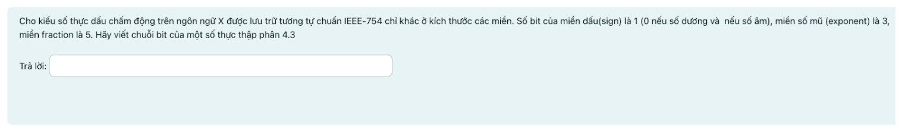
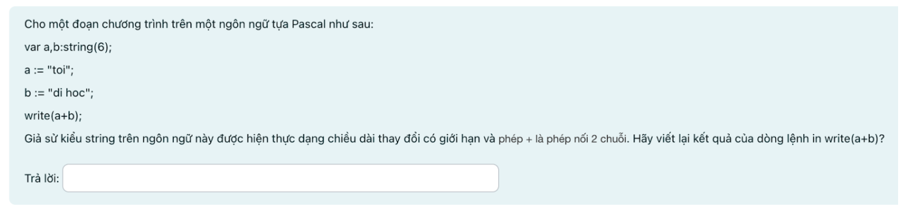
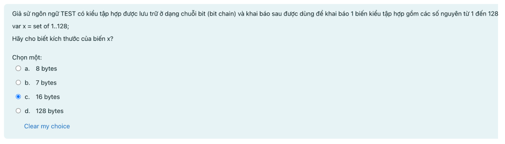
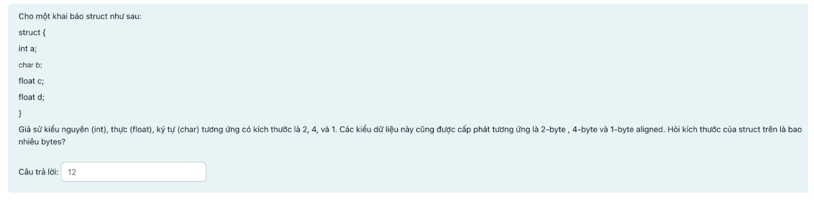
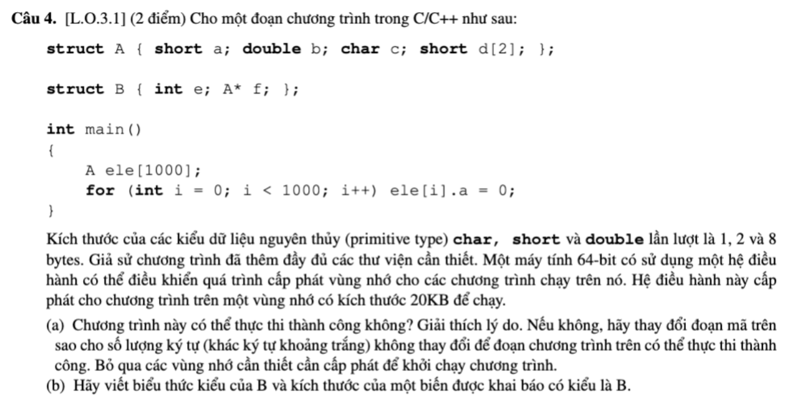
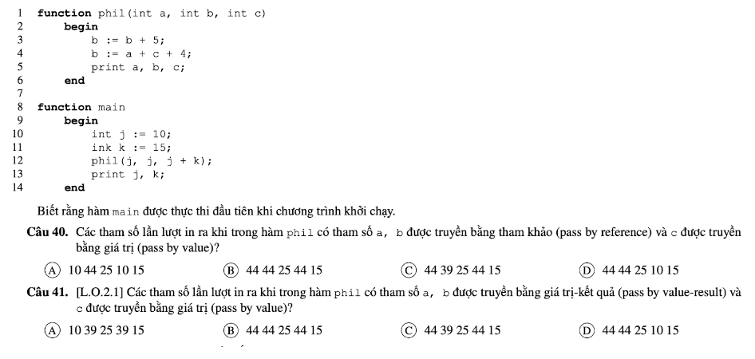

# Review Final Principles of Programming Languages

### Exercise 1


```
1 byte = 8 bit => Range of value: -128 to 127 => -56 = 1100 1000
```

### Exercise 2



```
4 -> 100
0.3 -> 0.6 -> 1.2 -> 0.4 -> 0.8 -> 1.6 -> 1.2 -> 0.4 -> ...

4.3 = 100.0100110 = 1.000100110 * 2^2

Sign: 0
Exponent: 2 -> 010
Fraction: 00010

4.3 = 0 010 00010
```

### Exercise 3



### Exercise 4



```
128 bits = 16 bytes
```

### Exercise 5



```
int a: 2 bytes -> 2 bytes
char b: 1 byte -> 3 bytes
float c: 4 bytes -> align 1 byte -> 8 bytes
float d: 4 bytes -> 12 bytes
```

### Exercise 6


### Exercise 7



### Exercise 8



```
j = a = b = 10
c = j + k = 25

b = b + 5 = 15 -> j = a = b = 15
b = a + c + 4 = 15 + 25 + 4 = 44 -> j = a = b = 44

print a, b, c print j, k
-> 44 44 25 44 15
-> B
```
